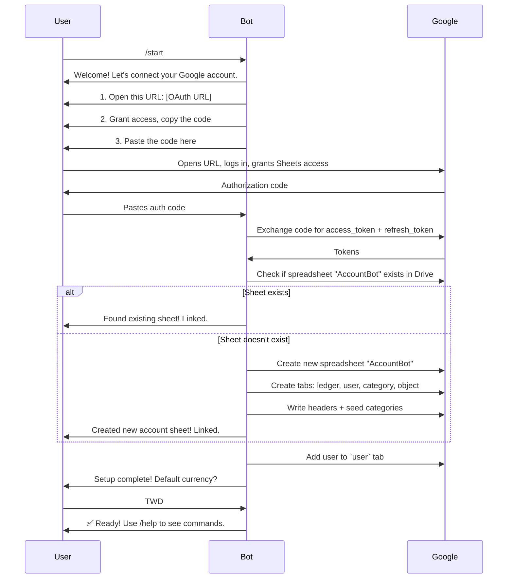
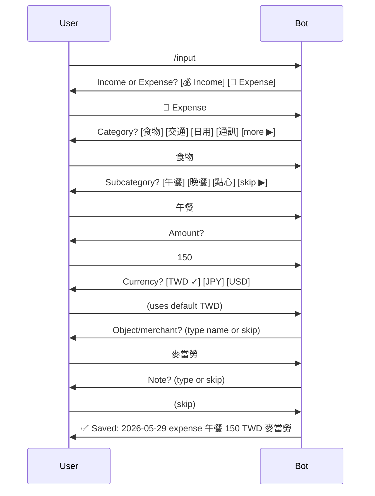
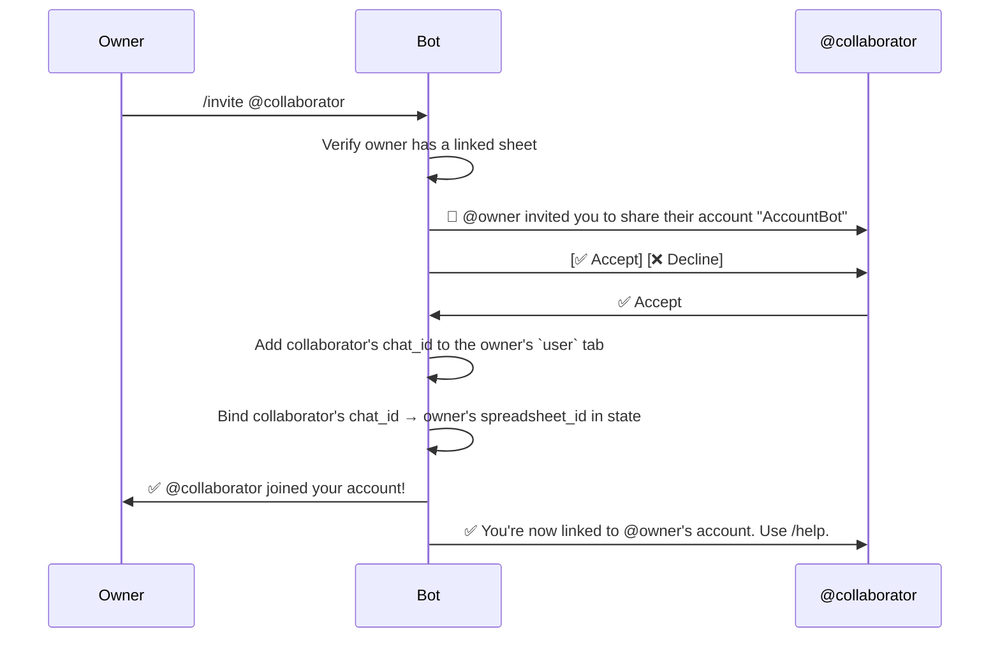

# Account Bot 2.0 — Specification

## 1. Overview

A Telegram bot for personal and shared bookkeeping. Users record income/expenses via Telegram; all data is stored in a Google Spreadsheet in the user's own Google Drive.

### 1.1 Goals
- Replace Zaim API with Google Sheets as the sole data backend.
- Single self-contained Elixir `.exs` script (`Mix.install`), no Mix project needed.
- Support both private chat and group chat.
- Multiple Telegram users can collaborate on the same spreadsheet.
- Bilingual UI (responds in the user's language — Traditional Chinese / English).

### 1.2 Non-Goals
- Web UI or dashboard (the spreadsheet *is* the dashboard).
- Currency conversion.
- Budgeting / alerts.

---

## 2. Architecture

```
┌──────────────┐      HTTPS polling       ┌──────────────────┐
│  Telegram    │◄────────────────────────► │  account_bot.exs │
│  Bot API     │                          │  (Elixir)        │
└──────────────┘                          └───────┬──────────┘
                                                  │
                                          Google Sheets API
                                          (OAuth 2.0)
                                                  │
                                          ┌───────▼──────────┐
                                          │  Google Sheets   │
                                          │  (user's Drive)  │
                                          └──────────────────┘
```

### 2.1 Runtime
- **Single `.exs` file** using `Mix.install/2` for dependencies.
- **Long-polling** the Telegram Bot API (no webhook, no external web server).
- **In-memory state**: a map of `chat_id → %{spreadsheet_id, google_token, ...}` loaded on startup, persisted to a local JSON file.

### 2.2 Dependencies (Mix.install)
| Hex Package | Purpose |
|---|---|
| `req` | HTTP client (Telegram API, Google Sheets API) |
| `jason` | JSON encoding/decoding |

> [!NOTE]
> No Telegram or Google Sheets wrapper libraries — we call the REST APIs directly with `Req` to keep dependencies minimal and the script self-contained.

### 2.3 Config

The bot reads a `config.json` file (same directory as the script):

```json
{
  "telegram_token": "BOT_TOKEN",
  "google_client_id": "xxx.apps.googleusercontent.com",
  "google_client_secret": "xxx"
}
```

A `state.json` file is auto-created to persist user/sheet bindings across restarts.

---

## 3. Data Model (Google Spreadsheet)

Each "account" is one Google Spreadsheet with 4 tabs (worksheets):

### 3.1 `ledger` tab

The primary data store. Each row is one transaction.

| Column | Type | Required | Description |
|---|---|---|---|
| date | `YYYY-MM-DD` | ✓ | Transaction date |
| user | string | ✓ | Telegram display name of who entered it |
| income/expense | `income` or `expense` | ✓ | Transaction type |
| category | string | ✓ | Category name (must exist in `category` tab) |
| subcategory | string | | Optional subcategory (child category) |
| amount | number | ✓ | Positive number |
| currency | string | ✓ | e.g. `TWD`, `JPY`, `USD` |
| object | string | | Counterparty/merchant name |
| note | string | | Free-form note |

Row 1 is the header row. Data starts at row 2. New entries are appended.

### 3.2 `user` tab

Tracks which Telegram users are linked to this spreadsheet.

| Column | Type | Description |
|---|---|---|
| chat_id | integer | Telegram chat ID |
| name | string | Telegram display name |
| default_currency | string | Default currency for this user (e.g. `TWD`) |

### 3.3 `category` tab

User-customizable categories with optional hierarchy and aliases.

| Column | Type | Description |
|---|---|---|
| id | integer | Unique ID (auto-increment) |
| parent_id | integer \| empty | Parent category ID (for subcategories) |
| alias_id | integer \| empty | Points to another category ID (this name is an alias) |
| name | string | Display name (e.g. `午餐`, `lunch`) |

**Hierarchy**: A category with `parent_id` set is a subcategory. When inputting, the parent is `category` and the child is `subcategory` in the ledger.

**Aliases**: A row with `alias_id` set means "this name maps to that category". For example, `剪髮 → 理髮`. Aliases have no `parent_id`.

**Seed data**: On sheet creation, the bot seeds common categories from the legacy bot's category map.

### 3.4 `object` tab

Reusable counterparty/merchant names with optional aliases.

| Column | Type | Description |
|---|---|---|
| id | integer | Unique ID |
| alias_id | integer \| empty | Points to another object ID |
| name | string | Display name (e.g. `7-Eleven`, `房東`) |

Objects are auto-created when a user enters a new merchant name for the first time.

---

## 4. Onboarding Flow (`/start`)



### 4.1 Google OAuth Details
- **Scopes**: `https://www.googleapis.com/auth/spreadsheets` and `https://www.googleapis.com/auth/drive.file`
- **Flow**: Standard OAuth 2.0 authorization code flow with manual copy-paste (no redirect server).
- **Token storage**: `refresh_token` persisted in `state.json` keyed by Telegram `chat_id`.
- **Token refresh**: Bot auto-refreshes `access_token` using `refresh_token` when expired.

### 4.2 Sheet Discovery
- Bot searches user's Drive for a spreadsheet named `AccountBot` using the Drive API.
- If found, validates it has the required tabs and headers.
- If not found, creates one with the full schema and seed data.

---

## 5. Commands

### 5.1 `/start`
Triggers onboarding (Section 4). If user is already linked, shows current status.

### 5.2 `/help`
Displays available commands and usage examples.

```
📖 Commands:
/start — Connect Google account
/input — Record a transaction (or just type: 午餐 麥當勞 150)
/list — View transactions
/edit — Edit a transaction
/delete — Delete a transaction
/invite @user — Invite a user to share your account
/help — Show this help

💡 Quick input: just type like:
  午餐 麥當勞 150
  income 薪水 50000
  20260115 晚餐 壽司 800
```

### 5.3 `/input` — Interactive Flow

Starts a step-by-step transaction entry via inline keyboards.



**Inline keyboard pagination**: Categories are shown in pages of 8 buttons (2×4 grid) with `◀ prev` / `▶ next` navigation.

### 5.4 Freeform Text Input (non-command messages)

Supports the legacy bot's text parsing syntax. Any non-command message is parsed as a potential transaction.

**Syntax**: `[YYYYMMDD] <category> [object] <amount>[元]`

| Pattern | Example | Parsed As |
|---|---|---|
| Basic | `午餐 150` | expense, 午餐, 150 TWD |
| With merchant | `午餐 麥當勞 150` | expense, 午餐, 麥當勞, 150 TWD |
| With date | `20260115 晚餐 壽司 800` | expense, 晚餐, 壽司, 800 TWD, Jan 15 |
| Income | `收入 薪水 50000` | income, 薪水, 50000 TWD |
| With 元 suffix | `咖啡 星巴克 180元` | expense, 咖啡, 星巴克, 180 TWD |

**Behavior after parse**:
1. Bot confirms the parsed entry with an inline keyboard: `[✅ Confirm] [✏️ Edit] [❌ Cancel]`
2. On confirm → append to ledger, show monthly summary.
3. On edit → switch to interactive flow with fields pre-filled.

**Category resolution**:
1. Exact match against `category.name` → use it.
2. Alias match against `category.name` where `alias_id` is set → resolve to target.
3. No match → prompt user to pick from inline keyboard or create new category.

### 5.5 `/list` — View Transactions

**Default**: Shows current month's transactions, most recent first.

**Inline keyboard filters**:
```
📊 May 2026 — 15 entries, total: 12,450 TWD

[📅 Date range] [📁 Category] [🏪 Object]
[◀ Prev month] [▶ Next month]
```

After selecting a filter:
- **Date range**: `[Today] [This week] [This month] [Custom]`
  - Custom: bot asks for start and end dates.
- **Category**: paginated category picker.
- **Object**: paginated object picker.

**Output format** (paginated, 10 per page):
```
📋 Transactions (May 2026):

1. 05/29 💸 午餐 麥當勞 150 TWD
2. 05/29 💸 電車 — 280 TWD
3. 05/28 💰 收款 — 5,000 TWD
...

[◀ 1/3 ▶]  [📊 Summary]
```

**Summary view** (toggled by `📊 Summary` button):
```
📊 May 2026 Summary:
  💸 Expense: 42,300 TWD
  💰 Income: 55,000 TWD
  ─────────
  Net: +12,700 TWD

  Top categories:
  1. 食物: 12,450 TWD (29%)
  2. 交通: 8,200 TWD (19%)
  3. 房租: 15,000 TWD (35%)
```

### 5.6 `/edit` — Edit a Transaction

1. Bot shows recent entries (like `/list`, last 10).
2. User picks an entry via inline keyboard button.
3. Bot shows the entry with editable fields as inline buttons:
   ```
   Editing #5 (05/29):
   [📅 Date: 05/29] [💸 Type: expense]
   [📁 Category: 午餐] [💰 Amount: 150]
   [💱 Currency: TWD] [🏪 Object: 麥當勞]
   [📝 Note: —]
   [✅ Save] [❌ Cancel]
   ```
4. User taps a field → bot asks for new value (text input or inline keyboard depending on field).
5. On save → update the corresponding row in the spreadsheet.

### 5.7 `/delete` — Delete a Transaction

1. Bot shows recent entries (like `/list`, last 10).
2. User picks an entry via inline keyboard button.
3. Bot shows confirmation: `Delete "05/29 午餐 麥當勞 150 TWD"? [✅ Yes] [❌ No]`
4. On confirm → delete the row from the spreadsheet.

### 5.8 `/invite @user` — Share Account

Works in **group chat** context:



**Rules**:
- The invitee does **not** need Google OAuth — the bot uses the **owner's** Google tokens for all API calls.
- The invitee is tracked in the `user` tab of the shared spreadsheet.
- In a group chat, the owner sets the group's active account via `/start`. All group members use that account.

> [!IMPORTANT]
> Only the spreadsheet **owner** needs to complete Google OAuth. Collaborators added via `/invite` use the owner's Google credentials for all Sheets API operations. They are tracked in the `user` tab but don't need their own Google account.

---

## 6. State Management

### 6.1 `state.json` — Persisted State

```json
{
  "users": {
    "123456789": {
      "spreadsheet_id": "1abc...xyz",
      "google_tokens": {
        "access_token": "ya29...",
        "refresh_token": "1//...",
        "expires_at": "2026-05-29T21:00:00Z"
      },
      "role": "owner"
    },
    "987654321": {
      "spreadsheet_id": "1abc...xyz",
      "google_tokens": null,
      "role": "collaborator",
      "owner_chat_id": "123456789"
    }
  },
  "groups": {
    "-100123456": {
      "spreadsheet_id": "1abc...xyz",
      "owner_chat_id": "123456789"
    }
  }
}
```

### 6.2 In-Memory State
- ETS table or Agent holding the above structure.
- Written to disk on every mutation (simple but sufficient for a personal bot).

---

## 7. Google Sheets API Usage

### 7.1 Key Operations

| Operation | API Endpoint | When |
|---|---|---|
| Create spreadsheet | `POST /v4/spreadsheets` | `/start` (new account) |
| Search for sheet | `GET /drive/v3/files?q=name='AccountBot'` | `/start` (check existing) |
| Read range | `GET /v4/spreadsheets/{id}/values/{range}` | `/list`, `/edit`, category lookup |
| Append row | `POST /v4/spreadsheets/{id}/values/{range}:append` | Input (new transaction) |
| Update row | `PUT /v4/spreadsheets/{id}/values/{range}` | `/edit` |
| Delete row | `POST /v4/spreadsheets/{id}:batchUpdate` (deleteDimension) | `/delete` |
| Read all tabs | `GET /v4/spreadsheets/{id}?fields=sheets.properties` | Validate structure |

### 7.2 Caching
- Categories and objects are cached in memory after first load.
- Cache is invalidated on any category/object mutation or after 5 minutes.

---

## 8. Conversation State Machine

The bot needs to track per-user conversation state for multi-step flows (e.g., `/input`, `/edit`, OAuth code entry).

```elixir
# Conversation states
:idle            # Waiting for command
:awaiting_oauth  # Waiting for OAuth code paste
:awaiting_currency # Waiting for default currency
:input_type      # Picking income/expense
:input_category  # Picking category
:input_subcategory # Picking subcategory
:input_amount    # Typing amount
:input_currency  # Picking currency
:input_object    # Typing object
:input_note      # Typing note
:input_confirm   # Confirming freeform parse
:edit_select     # Picking entry to edit
:edit_field       # Picking field to edit
:edit_value      # Typing new value
:delete_select   # Picking entry to delete
:delete_confirm  # Confirming deletion
:invite_pending  # Waiting for invitee to accept
```

State is stored in-memory per `chat_id`. Timeout: states auto-reset to `:idle` after 5 minutes of inactivity.

---

## 9. Error Handling

| Scenario | Behavior |
|---|---|
| Google token expired | Auto-refresh using `refresh_token`. If refresh fails, ask user to re-auth. |
| Sheet deleted externally | On next API call, detect 404, prompt user to `/start` again. |
| Invalid input | Reply with usage hint, don't crash. |
| Rate limiting (Google) | Exponential backoff, notify user if persistent. |
| Bot restart | Reload `state.json`, all conversation states reset to `:idle`. |

---

## 10. Design Decisions (Resolved)

| Question | Decision |
|---|---|
| **Sheet naming** | Default `AccountBot`, but user can rename during `/start` or later |
| **Category seeding** | Full legacy category list from v1 bot |
| **Multiple accounts** | Yes — a user can own multiple spreadsheets (e.g., personal vs. business). `/start` can create or switch accounts. |
| **Timezone** | Per-user configurable, default to server's local timezone (`TZ` env var) |
| **Backup/export** | No — the spreadsheet in Google Drive is sufficient |

---

## 11. Google Cloud OAuth Setup Guide

### 11.1 Create a GCP Project

1. Go to [Google Cloud Console](https://console.cloud.google.com/)
2. Click **Select a project** → **New Project**
3. Name it (e.g., `account-bot`) → **Create**

### 11.2 Enable APIs

1. Go to **APIs & Services** → **Library**
2. Search and enable:
   - **Google Sheets API**
   - **Google Drive API**

### 11.3 Configure OAuth Consent Screen

1. Go to **APIs & Services** → **OAuth consent screen**
2. Select **External** user type → **Create**
3. Fill in:
   - App name: `AccountBot`
   - User support email: your email
   - Developer contact: your email
4. **Scopes** → **Add or Remove Scopes** → add:
   - `https://www.googleapis.com/auth/spreadsheets`
   - `https://www.googleapis.com/auth/drive.file`
5. **Test users** → add your Google account email(s)
6. **Save**

> [!NOTE]
> While in "Testing" status, only test users you add can authorize. This is fine for a personal bot. To remove the test-user limit, you'd need to publish and verify the app — not necessary for personal use.

### 11.4 Create OAuth Client Credentials

1. Go to **APIs & Services** → **Credentials**
2. Click **+ Create Credentials** → **OAuth client ID**
3. Application type: **Desktop app** (or "TV & Limited Input")
4. Name: `AccountBot`
5. Click **Create**
6. Copy the **Client ID** and **Client Secret**

### 11.5 Configure the Bot

Put the credentials in `config.json`:

```json
{
  "telegram_token": "YOUR_BOT_TOKEN",
  "google_client_id": "123456-xxx.apps.googleusercontent.com",
  "google_client_secret": "GOCSPX-xxx"
}
```

### 11.6 OAuth Flow (What Happens at Runtime)

When a user runs `/start`, the bot constructs this URL:

```
https://accounts.google.com/o/oauth2/v2/auth?
  client_id=CLIENT_ID&
  redirect_uri=urn:ietf:wg:oauth:2.0:oob&
  response_type=code&
  scope=https://www.googleapis.com/auth/spreadsheets+https://www.googleapis.com/auth/drive.file&
  access_type=offline&
  prompt=consent
```

> [!IMPORTANT]
> Use `redirect_uri=urn:ietf:wg:oauth:2.0:oob` (out-of-band) so Google shows the auth code on screen for the user to copy-paste back to the bot. No callback server needed.
>
> Note: Google has deprecated the `oob` redirect for some app types. If this doesn't work, use `redirect_uri=http://localhost` instead — the user copies the code from the URL bar after the redirect fails to connect.

The bot then exchanges the code for tokens:

```
POST https://oauth2.googleapis.com/token
  code=AUTH_CODE&
  client_id=CLIENT_ID&
  client_secret=CLIENT_SECRET&
  redirect_uri=urn:ietf:wg:oauth:2.0:oob&
  grant_type=authorization_code
```

Response includes `access_token`, `refresh_token`, and `expires_in`.

---

## 12. CLI: `--import` Option

The script supports a `--import` flag for one-time batch import of Zaim JSONL dump data into an existing Google Sheet.

### 12.1 Usage

```bash
elixir account_bot.exs --import 20260529_zaim.jsonl --sheet-id SPREADSHEET_ID --token-file state.json --chat-id 123456789
```

| Flag | Required | Description |
|---|---|---|
| `--import FILE` | ✓ | Path to Zaim JSONL dump file |
| `--sheet-id ID` | ✓ | Target Google Spreadsheet ID |
| `--token-file FILE` | | Path to `state.json` (default: `./state.json`) |
| `--chat-id ID` | ✓ | Owner's Telegram chat_id (to look up Google tokens from state) |
| `--dry-run` | | Parse and print mapping without writing to Sheets |
| `--user NAME` | | Override the `user` column value (default: owner's name from `user` tab) |

### 12.2 Zaim JSONL Field Mapping

Each line in the JSONL is a JSON object. Mapping to the ledger tab:

| Zaim Field | Ledger Column | Mapping Logic |
|---|---|---|
| `date` | date | Direct (`YYYY-MM-DD`) |
| — | user | From `--user` flag or owner's name in `user` tab |
| `mode` | income/expense | `"payment"` → `"expense"`, `"income"` → `"income"` |
| `genre_id` / `category_id` | category | Resolve via Zaim category map (see §12.3) |
| — | subcategory | Resolved from genre_id when it's a child of category_id |
| `amount` | amount | Direct (integer) |
| `currency_code` | currency | Direct (e.g., `"TWD"`) |
| `place` | object | Direct (merchant name string) |
| `comment` | note | Direct |

**Ignored Zaim fields**: `id`, `user_id`, `from_account_id`, `to_account_id`, `active`, `created`, `name`, `receipt_id`, `place_uid`.

### 12.3 Zaim Category ID Map

The bot includes a hardcoded map from Zaim `genre_id` → category/subcategory names:

```
# Expense categories (category_id → name)
101 → 食費        103 → 交通        105 → 水道光熱
102 → 日用雜貨    104 → 通訊        106 → 住宅
107 → 交際費      108 → 娛樂        109 → 教育
110 → 醫療保健    111 → 美容衣服    112 → 汽車
113 → 稅金        114 → 大型出費    199 → 其他

# Expense subcategories (genre_id → name)
10101 → 食物    10102 → 點心/咖啡  10103 → 早餐
10104 → 午餐    10105 → 晚餐       10199 → 其他食費
10201 → 雜貨    10299 → 其他日用
10301 → 電車    10302 → 計程車     10303 → 公車     10304 → 機票    10399 → 其他交通
10401 → 行動通訊 10402 → 市話      10403 → 網路     10404 → 電視    10405 → 快遞    10406 → 郵票  10499 → 其他通訊
10501 → 水費    10502 → 電費       10503 → 瓦斯
10601 → 房租    10602 → 房貸       10603 → 家具     10604 → 家電    10605 → 裝潢
10701 → 請客    10702 → 禮物       10703 → 紅包
10801 → 休閒    10802 → 展覽       10803 → 電影     10804 → 音樂    10805 → 漫畫    10806 → 書籍  10807 → 遊戲
10901 → 上課    10904 → 考試       10905 → 學費
11001 → 看病    11002 → 藥物       11003 → 保險     11099 → 其他醫療
11101 → 衣服    11102 → 配件       11104 → 健身     11105 → 理髮    11106 → 化妝品  11107 → 美容  11108 → 洗衣
11201 → 加油    11202 → 停車       11207 → 過路費   11299 → 其他汽車
11302 → 所得稅
11401 → 旅行    11402 → 房屋       11403 → 汽車     11404 → 機車    11407 → 看護    11409 → 其他大型  11499 → 其他大型
19901 → 匯款    19902 → 零用       19904 → 預付     19905 → 立替     19906 → 提款    19908 → 儲值  19909 → 其他  19999 → 其他

# Income categories (category_id → name, no subcategories)
11 → 薪水    12 → 預付返還    13 → 獎金
15 → 營收    19 → 其他收入
```

### 12.4 Import Behavior

1. Parse all JSONL lines, map fields, skip rows where `active != 1`.
2. Auto-create any missing categories/objects in their respective tabs.
3. Sort by date ascending before appending.
4. Append all rows to `ledger` tab in a single `values:append` batch (chunked in batches of 500 to avoid API limits).
5. Print summary: `Imported N entries (X expense, Y income) spanning DATE_FROM to DATE_TO`.

### 12.5 Idempotency

Import is **not** idempotent — running it twice will duplicate rows. The `--dry-run` flag exists to preview before committing. If needed, the user can clear the ledger tab in the spreadsheet and re-import.

---

## 13. Migration from v1

- Category names from v1 are preserved as seed data in the `category` tab (full legacy list).
- The Zaim JSONL dump (`20260529_zaim.jsonl`, 10,263 records, 2015-05 to 2026-05) can be imported via `--import` (Section 12).
- No automatic migration at bot startup — import is an explicit manual step.
